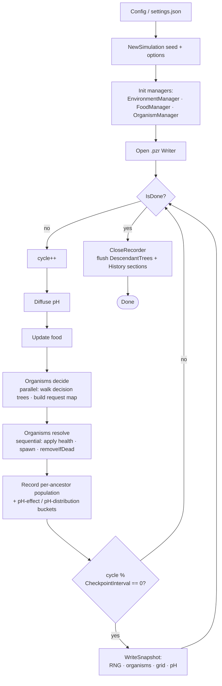
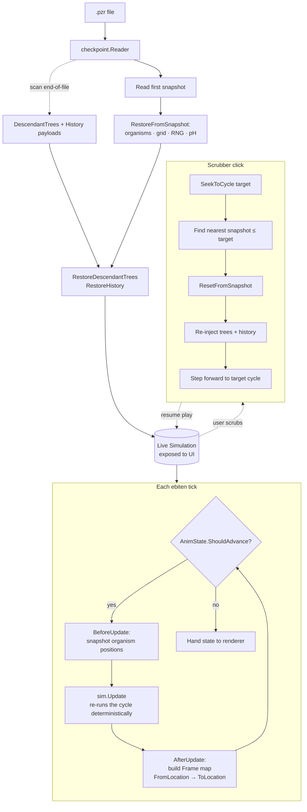
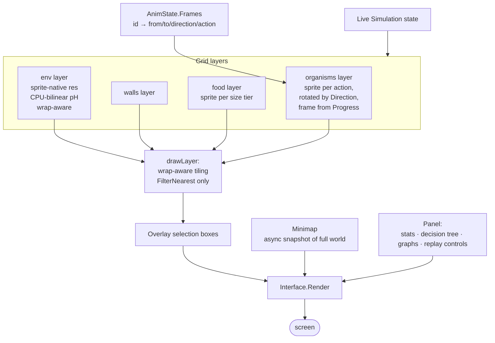

# Protozoa
A simulation of organisms navigating their environment according to inherited traits and decision trees.
Rendered with [ebitengine](https://github.com/hajimehoshi/ebiten)


## Simulation Rules 
Protozoa randomly generates a number of organisms and food items on a 2D grid. Per render cycle, each organism chooses a simple action (eat, move, turn, attack etc.) based on a randomly-generated decision tree with which it was initialized. Organisms that survive long enough can spawn offspring with very slight mutations, thus propagating successful traits and behaviors.

### Environment
The environment consists of a 2D wraparound grid. Each location contains a ph value (0-10). These ph values play a large role in organism health, and are likewise affected by certain organism actions (ie. growth). 

Each cycle, ph values diffuse between neighboring grid locations at a regular rate, such that the whole environment will gradually approach a single ph value in the absence of organism activity.

Low ph (acidic) locations appear green, high ph (alkaline) locations are pink, and neutral locations (~5.0 ph) are black.


Additionally, the environment can be separated by walls into 'pools' with small openings allowing diffusion and movement in between. This is meant to allow different families of organisms to develop in isolation longer than would otherwise be possible. (The existence and size of these pools can be set in the configuration json files in `settings/`)


### Food

'Food' items are generated when organisms die. Each food item is represented by a dark gray square and contains a value between 0 and 100, representing how much the food item contains. When an organism sees a food item directly ahead, it can choose to 'eat' it, subtracting some value from the food and adding it to its own health. If a food item's value is reduced to 0, it disappears from the grid. Conversely, when an organism's health is reduced to 0 it 'dies' and is immediately replaced with a food item, whose value is set equal to the organism's size at death.

Apart from feeding organisms, food items also prevent movement. Organisms and food items cannot occupy the same location, and an organism facing a food item directly ahead cannot move through it.


### Organisms

Organisms are represented by colored squares of different sizes, and they perform actions in their environment according to a set of genetic traits and a single decision tree. 'Health' and 'energy' are the same thing for organisms, and an organism's actions (moving, eating, etc.) may reduce its own health by some small amount to represent the energy exertion needed to do them. Further, an organism unable to tolerate the ph of its location will also have its health reduced until conditions improve.

An organism's health is limited by its current size, so an organism of size 50 will have a max health of 50. When an organism gains more health than its size allows, it 'grows' in size by some fraction of the excess health gain.

#### Traits
Initial organisms are generated with random values for several 'genetic' traits that define its size limitations, its ph tolerance, the time it waits betweeen spawning, etc. When spawning a new organism, the traits of the parent are adjusted by small random amounts and passed down to the new child.
  * **Color -** _generated from random hue, saturation, and brightness_
  * **MaxSize -** _the maximum size an organism can grow_
  * **SpawnHealth -** _the initial health given to a spawned child, which is also subtracted from the parent's health_
  * **MinHealthToSpawn -** _the minimum health required by the parent to spawn a new child (never less than SpawnHealth)_
  * **MinCyclesBetweenSpawns -** _the minimum number of cycles that must pass before the organism can produce another child_
  * **IdealPh -** _The middle of the organism's ph tolerance range_
  * **PhTolerance -** _The absolute ph distance the organism can go from its ideal ph without adverse effects. (eg. An ideal ph of 3 and ph tolerance of 1 provide a tolerance zone of 2-4 ph)_
  * **PhEffect -** _the positive or negative factor the organism's growth has on the ph level of its location)_

#### Decision Trees
Each organism's behavior is governed by a decision tree composed of various conditions and actions. Organisms generated at simulation start are given randomly-selected trees built from these decision nodes, while spawned children inherit an identical or similar variation of their parents' decision tree. and chosen from the following:
##### Conditions
  * **CanMoveAhead -** _checks if the organism can move forward (false if a food item or another organism directly ahead)_
  * **IsRandomFiftyPercent -** _returns true if a randomly generated float is less than .5_
  * **IsFoodAhead -** _true if a food item directly ahead_
  * **IsFoodLeft -** _true if a food item lies 90 degrees to the left_
  * **IsFoodRight -** _true if a food item lies 90 degrees to the right_
  * **IsOrganismAhead -** _true if an organism directly ahead_
  * **IsOrganismLeft -** _true if an organism lies 90 degrees to the left_
  * **IsOrganismRight -** _true if an organism lies 90 degrees to the right_
  * **IsBiggerOrganismAhead -** _true if an organism of greater size directly ahead_
  * **IfHealthAboveFiftyPercent -** _true if organism's health values more than half its current size_
  * **IsHealthyPhHere -** _true if the ph level at current location is within the organism's tolerance - having no harmful health effects and allowing for chemosynthesis_
  * **IsHealthierPhAhead -** _true if the ph level directly ahead is closer to the organism's ideal ph than the ph at its current location tolerance_
##### Actions
  * **Chemosynthesis -** _generates a small amount of health, if performed at a location with healthy ph_
  * **Eat -** _consumes a small amount of health to consume any food that lies directly ahead_
  * **Move -** _consumes a small amount of health to move forward, if no food or organism directly ahead_
  * **TurnLeft --** _consumes a small amount of health to turn 90 degrees left_
  * **TurnRight -** _consumes a small amount of health to turn 90 degrees right_
  * **Attack -** _consumes a large amount of health to reduce the health of any organism directly ahead_
  * **Feed -** _transfers a small amount of health to any organism directly ahead_

##### Decision Tree Health Effects
Because decision trees are randomly generated and mutated, many trees will have areas of redundancy and illogic, containing branches that have no possibility of ever being reached. As a way to reward logical algorithms, Organisms lose a very small amount of health each cycle for every node in their decision tree, as a way to simulate the energy needed to process complicated decision-making. Thus, over time, subsequent mutations to decision trees should allow more efficient organisms to outpace those with similar behaviors but less efficient algorithms.

#### Display
Clicking on an organism in the simulation grid will display its traits and decision tree in the left-hand panel, as shown:

 

As printed, each conditional statement (eg. "If Can Move Ahead") is followed by a line that splits into two branches. The first, top-most branch is the logic the organism will follow if the checked condition returns true. The second, bottom branch will evaluate if the condition returns false. All decision tree nodes evaluated in the previous cycle are followed by "◀◀". Thus, the example decision tree shows - in the previous cycle - the selected organism checked 'If Can Move Ahead' (true), checked 'If Food Right' (false), and so it chose the 'Move Ahead' action.

# Architecture

Protozoa runs in three distinct modes that share a common simulation core: a **headless simulation** that advances the world deterministically and writes a `.pzr` replay file, a **replay viewer** that re-runs the simulation against that file, and the **renderer** that paints whatever the live or replayed simulation currently looks like.

## Headless simulation loop

The headless loop is the source of truth. Given a seed and a config, it produces a fully deterministic sequence of cycles and streams the result to a `.pzr` file. The replay viewer just re-plays this sequence later.



The `decide` phase is parallel because each organism reads its own state and writes only to its worker's local request map; the `resolve` phase is sequential and the only place that mutates shared grids and applies organism deaths.

## Replay flow

The replay viewer opens a `.pzr` file, restores from the nearest snapshot, then advances the simulation forward in real time. Every cycle the viewer plays is the *same* simulation step the headless loop ran — same RNG, same organism actions, same outcomes.



`AnimState` is the wall-clock pacer: at Speed 1x one cycle takes 4 animation frames at 12 fps; at higher speeds the cycle window shrinks (multiple sim steps may fire per tick); at fractional speeds (1/2x, 1/4x) the window stretches for slow-motion.

## Rendering pipeline

The renderer is read-only: it samples the live simulation and the current `AnimState.Frames` map and paints them. It never mutates simulation state.



The env layer is the only one with non-trivial colour math: each pixel is bilinearly interpolated from the four nearest cells' pH values with wrap-aware sampling, so the pH gradient stays smooth across the world-wrap boundary without the seam that GPU `FilterLinear` would leave there. Every other layer is sprite-native pixel art and composed with `FilterNearest` so the look stays crisp.

# Setup
```
go get
go run .
```
## Run Options
```-config``` Use overriden simulation constants. Ex:
```
go run . -config=settings/small.json
go run . -config=settings/big.json
```
```-seed``` Set the random seed used by the simulation. Ex:
```
go run . -seed=2
```
```-debug``` Display memory usage and FPS
```
go run . -debug=true
```

# Config
You can create your own .json config files to override simulation constants at runtime.
To print the default settings as json (you can paste and edit this in a new configuration .json file)
```
go run . -dump-config
```

# Run Headless
- Single trial:
```
go run . -headless
```
- Multiple trials:
```
go run . -headless -trials=10
```

# Saving and Replaying Simulations
Every run writes a `.pzr` replay file. By default it goes to a stable path in the system temp directory (`protozoa_last.pzr`) and gets overwritten the next time you start a new run. To keep a simulation around, save it to an explicit path instead:

- Save a run to a chosen file:
```
go run . -checkpoint=runs/big_mutation.pzr
```

- Replay a saved file:
```
go run . -replay=runs/big_mutation.pzr
```

- Resume the last run still sitting in the temp directory (no need to remember the path — useful right after closing the window):
```
go run . -resume=true
```
If the temp file has been cleared or a new run has already overwritten it, `-resume` falls through to the normal startup path and prints a note. Explicit `-replay` wins over `-resume`, and `-resume` is ignored under `-headless` (no GUI to show the replay).

# Run in a Browser (WebAssembly)

Protozoa builds to WebAssembly via ebiten's wasm support. Sprite sheets, fonts, and `settings/default.json` are bundled into the binary via `go:embed`, so the wasm build is fully self-contained — no separate asset hosting needed.

Build the wasm binary and stage Go's wasm runtime under `web/`:
```
./web/build.sh
```

The script writes `web/protozoa.wasm` and `web/wasm_exec.js`. Then serve the `web/` directory with any static file server and open it in a browser:
```
python3 -m http.server 8080 --directory web
# open http://localhost:8080/
```

Notes / current limitations:
- The wasm build runs in **live-only mode**: the in-browser file system is virtual, so saved replays don't survive a page reload. Replay controls work within a session but the `-resume` and `-replay` workflows are desktop-only.
- CLI flags don't apply (the browser doesn't pass `os.Args`); the wasm build always boots with default settings.
- The wasm binary is ~14 MB (mostly Go runtime + embedded sprite sheets). First load is the cold cost; subsequent loads can be cached.

# Test
```
go test test/utils_test.go
```
